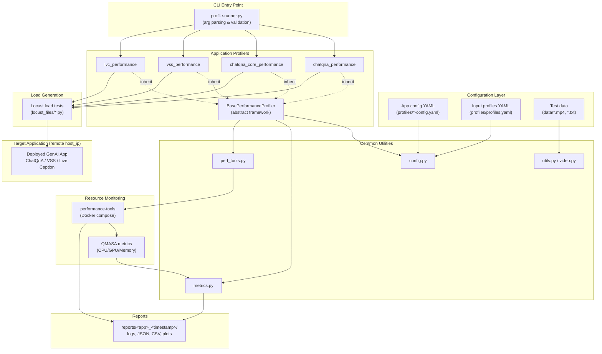
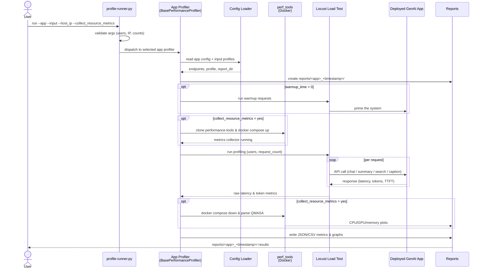

# GenAI Applications Sizing Tool

The GenAI Applications Sizing Tool is a performance profiling utility for benchmarking Intel's Edge AI library applications. This guide will walk you through the initial setup, configuration, and usage of the tool.

## Overview

The GenAI Applications Sizing Tool is:

- **Mutli application supports** ChatQnA (Modular & Core), Video Summary and Search, live captioning 
- **Resource Monitoring** including CPU, GPU, and memory consumption
- **Flexible Configuration** Two layer Yaml based configuration (Profiles and App config)
- **Comprehensive Reporting** reports with logs, JSON/CSV, plots

### Supported Applications

| Application | Description | Config File |
|-------------|-------------|-------------|
| `video_summary_search` | Video summarization and search profiling | `profiles/video-summary-config.yaml` |
| `chatqna` | ChatQnA modular application | `profiles/chatqna-config.yaml` |
| `chatqna_core` | ChatQnA core application | `profiles/chatqna-core-config.yaml` |
| `live_caption` | Live video captioning | `profiles/live-video-caption-config.yaml` |

## Architecture

The tool follows a layered architecture. A single CLI entry point (`profile-runner.py`)
dispatches to an application-specific profiler. All profilers share a common
`BasePerformanceProfiler` framework and a set of common utilities for configuration,
load generation (Locust), resource-metrics collection (Dockerized performance-tools),
and reporting.



### How It Works

The end-to-end profiling run proceeds through warmup, metrics collection, load
execution against the deployed application, and report generation.



## Prerequisites

### Software Requirements

- Python 3.11 or higher
- Docker (optional, for containerized execution)
- Git (for cloning performance tools)

### Target Application Deployment

Before running the sizing tool, ensure the target application is deployed and accessible. Refer to the deployment guides for each application:

**Video Search and Summarization:**
- [Get Started](../../sample-applications/video-search-and-summarization/docs/user-guide/get-started.md)
- [System Requirements](../../sample-applications/video-search-and-summarization/docs/user-guide/get-started/system-requirements.md)

**Chat Question and Answer:**
- [Sample Application README](../../sample-applications/chat-question-and-answer/README.md)

**Chat Question and Answer Core:**
- [Sample Application README](../../sample-applications/chat-question-and-answer-core/README.md)

**Live Video Captioning:**
- [Sample Application README](https://github.com/open-edge-platform/edge-ai-suites/blob/release-2026.1.0/metro-ai-suite/live-video-analysis/live-video-captioning/README.md)

## Installation

### Option 1: Local Installation

1. **Clone the repository** (if not already done):

   ```bash
   git clone <repository-url>
   cd edge-ai-libraries/tools/genai-applications-sizing
   ```

2. **Create a virtual environment**:

   ```bash
   python3 -m venv venv
   source venv/bin/activate
   ```

3. **Install dependencies**:

   ```bash
   pip install -r requirements.txt
   ```

### Option 2: Docker Installation

1. **Build the Docker image**:

   ```bash
   docker build -t genai-sizing-tool .
   ```

2. **Run with Docker** (see [Running with Docker](#running-with-docker) section below).

## Configuration

### Video Summary Configuration

The tool uses YAML configuration files to define API endpoints and input profiles. The video summary configuration is located at `profiles/video-summary-config.yaml`:

```yaml
global:
  report_dir: 'reports'
  input_profiles_path: 'profiles/profiles.yaml'
  perf_tool_repo: 'https://github.com/intel-retail/performance-tools.git'

apis:
  video_summary:
    enabled: true
    service_name: 'video'
    endpoints:
      upload: '12345/manager/videos'
      summary: '12345/manager/summary'
      states: '12345/manager/states'
      telemetry: '9766/v1/telemetry'
    input_profile: 'video_summary_wsf'
```

### Input Profiles

Input profiles define the test data and parameters. Video summary profiles are defined in `profiles/profiles.yaml`:

```yaml
profiles:
  video_summary_wsf:
    input_type: "video"
    input_size: "medium"
    files:
      - name: "one-by-one-person-detection.mp4"
        path: "data/one-by-one-person-detection.mp4"
    payload:
      # Sampling and prompt configuration
      ...
```

### Preparing Test Videos

Place your test video files in the `data/` directory. The profile configuration should reference these files:

```bash
# Copy your test video to the data directory
cp /path/to/your/video.mp4 data/
```

Update the profile in `profiles/profiles.yaml` to reference your video file.

## Running the Tool

### Basic Usage

Run the Video Summary sizing profile:

```bash
python profile-runner.py \
  --app=video_summary_search \
  --input=profiles/video-summary-config.yaml \
  --host_ip=<IP_ADDRESS_OF_DEPLOYED_APP> \
  --request_count=1 \
  --collect_resource_metrics=yes
```

### Command-Line Arguments

| Argument | Description | Default | Required |
|----------|-------------|---------|----------|
| `--app` | Application to profile (`video_summary_search`, `chatqna`, `chatqna_core`, `live_caption`) | - | Yes |
| `--input` | Path to configuration YAML file | `config.yaml` | No |
| `--host_ip` | IP address of the deployed application | - | Yes |
| `--request_count` | Total number of requests to execute | `1` | No |
| `--users` | Number of concurrent users (currently set to 1) | `1` | No |
| `--spawn_rate` | Rate at which users are spawned per second | `1` | No |
| `--warmup_time` | Duration in seconds for warmup requests | `0` | No |
| `--collect_resource_metrics` | Enable resource metrics collection (`yes`/`no`). When set to `yes`, the tool and target application must be running on the same machine. | `no` | No |

### Example: Video Summary with Warmup

For more accurate results, use a warmup period to prime the system:

```bash
python profile-runner.py \
  --app=video_summary_search \
  --input=profiles/video-summary-config.yaml \
  --host_ip=192.168.1.100 \
  --request_count=10 \
  --warmup_time=60 \
  --collect_resource_metrics=yes
```

### Running with Docker

```bash
docker run --rm \
  -v $(pwd)/data:/app/data \
  -v $(pwd)/reports:/app/reports \
  genai-sizing-tool \
  --app=video_summary_search \
  --input=profiles/video-summary-config.yaml \
  --host_ip=192.168.1.100 \
  --request_count=1 \
  --collect_resource_metrics=yes
```

## Understanding the Output

### Report Directory Structure

Reports are saved in the `reports/` directory with timestamped folders:

```
reports/
└── video_summary_search_20260320_134736/
    ├── perf_tool_logs/           # Performance tool logs
    └── video_summary/
        ├── video_summary_metrics_wsf.csv              # Summary metrics
        ├── video_summary_search_metrics.json          # Detailed metrics
        ├── video_summary_search_telemetry_details.json # Telemetry data
        └── video_response_*.txt                       # Video response details
```

### Key Metrics

The tool captures the following metrics:

| Metric | Description |
|--------|-------------|
| **Response Time** | End-to-end latency for video summarization |
| **Throughput** | Requests processed per second |
| **Upload Time** | Time to upload video to the service |
| **Processing Time** | Time for video analysis and summarization |
| **Resource Utilization** | CPU, GPU, and memory usage (when enabled) |

### Sample Output

```
Hardware sizing started for the 'video_summary_wsf' profile...
Sending warmup requests to video summary API...
Completed warmup requests.!

[Locust output with request statistics]

Report saved to: reports/video_summary_search_20260320_143044/
```

## Other Application References

### ChatQnA (Modular)

The ChatQnA modular application provides document-based question answering with RAG (Retrieval-Augmented Generation) capabilities.

#### Configuration

Configuration file: `profiles/chatqna-config.yaml`

```yaml
apis:
  stream_log:
    enabled: true
    service_name: 'chatqna'
    endpoints:
      chat: '8101/v1/chatqna/chat'
      document: '8101/v1/dataprep/documents'
    input_profile: 'chatqna_wsf'
```

#### Example Command

```bash
python profile-runner.py \
  --app=chatqna \
  --input=profiles/chatqna-config.yaml \
  --host_ip=<IP_ADDRESS> \
  --request_count=10 \
  --collect_resource_metrics=yes
```

#### Input Profile

The `chatqna_wsf` profile uses text-based inputs:

```yaml
chatqna_wsf:
  input_type: "text"
  input_size: "small"
  files:
    - name: "file1.txt"
      path: "data/file1.txt"
  prompt: "Analyze and interpret the sonnet..."
  max_tokens: "1024"
```

#### Deployment Reference

- [Chat Question and Answer Sample Application](../../sample-applications/chat-question-and-answer/README.md)

---

### ChatQnA Core

The ChatQnA Core application is a streamlined version optimized for core question-answering functionality.

#### Configuration

Configuration file: `profiles/chatqna-core-config.yaml`

```yaml
apis:
  stream_log:
    enabled: true
    service_name: 'chatqna'
    endpoints:
      chat: '8102/v1/chatqna/chat'
      document: '8102/v1/chatqna/documents'
    input_profile: 'chatqna_wsf'
```

#### Example Command

```bash
python profile-runner.py \
  --app=chatqna_core \
  --input=profiles/chatqna-core-config.yaml \
  --host_ip=<IP_ADDRESS> \
  --request_count=10 \
  --collect_resource_metrics=yes
```

#### Deployment Reference

- [Chat Question and Answer Core Sample Application](../../sample-applications/chat-question-and-answer-core/README.md)

---

### Live Video Caption

The Live Video Caption application provides real-time captioning for video streams using AI models.

#### Configuration

Configuration file: `profiles/live-video-caption-config.yaml`

```yaml
apis:
  live_caption:
    enabled: true
    service_name: 'live_caption'
    endpoints:
      runs: '4173/api/runs'
      metadata: '4173/api/runs/metadata-stream'
    captioning_time: 180  # Time in seconds for captioning duration
    input_profile: 'live_video_caption_wsf'
```

#### Example Command

```bash
python profile-runner.py \
  --app=live_caption \
  --input=profiles/live-video-caption-config.yaml \
  --host_ip=<IP_ADDRESS> \
  --warmup_time=30 \
  --collect_resource_metrics=yes
```

> **Note**: The `--request_count` parameter is not applicable for live captioning as it operates on continuous streams.

#### Key Configuration Options

| Option | Description |
|--------|-------------|
| `captioning_time` | Duration in seconds to run the captioning session |
| `runs` endpoint | API endpoint for starting caption runs |
| `metadata` endpoint | Streaming endpoint for caption metadata |

---

## Troubleshooting

### Common Issues

**Connection Refused**
```
Error: Connection refused to http://<ip>:12345
```
- Verify the target application is running and accessible
- Check firewall settings allow traffic on the required ports

**Video Upload Failed**
```
Warmup: Video upload failed, skipping this iteration
```
- Ensure test videos exist in the `data/` directory
- Verify the video file path in `profiles/profiles.yaml`

**Invalid IP Address**
```
Invalid IP address format: <ip>
```
- Use IPv4 format (e.g., `192.168.1.100`)
- Do not include protocol prefixes (http://)

### Validation

Before running a full profiling session:

1. Verify application connectivity:
   ```bash
   curl http://<host_ip>:12345/manager/videos
   ```

2. Start with a single request:
   ```bash
   python profile-runner.py \
     --app=video_summary_search \
     --input=profiles/video-summary-config.yaml \
     --host_ip=<IP> \
     --request_count=1
   ```

## Supporting Resources

- **Video Search and Summarization**
  - [API Reference](../../sample-applications/video-search-and-summarization/docs/user-guide/api-reference.md)
  - [Get Started Guide](../../sample-applications/video-search-and-summarization/docs/user-guide/get-started.md)
- **Chat Question and Answer**
  - [Sample Application](../../sample-applications/chat-question-and-answer/README.md)
- **Chat Question and Answer Core**
  - [Sample Application](../../sample-applications/chat-question-and-answer-core/README.md)
- **Live Video Captioning**
  - [Sample Application](https://github.com/open-edge-platform/edge-ai-suites/blob/release-2026.1.0/metro-ai-suite/live-video-analysis/live-video-captioning/README.md)
- [Performance Tools Documentation](https://github.com/intel-retail/performance-tools)
- Customize input profiles in `profiles/profiles.yaml` for your use case
- Enable resource metrics collection for detailed hardware analysis


