# OpenClaw Teacher Assistant — Benchmarking Guide

A detailed reference for **what** we benchmark in the OpenClaw Teacher Assistant
demo, **which KPIs** we collect, the **different ways** to collect them, and —
importantly — **why not every KPI can be read from the debug JSONL logs**, with
the root cause explained against the OpenClaw telemetry pipeline.

---

## 1. What "OpenClaw benchmarking" means here

OpenClaw benchmarking = driving a **fixed, repeatable workload** (a set of
teacher-assistant prompts) through the running OpenClaw agent and measuring the
performance of each agent turn end-to-end: how long a request takes, how quickly
the first token comes back, how long the model spends "planning" vs. calling
tools vs. aggregating the final answer, how each **agent** and each **tool**
behaves, and the overall **throughput** of the system.

It is a **black-box, telemetry-driven** benchmark:

- We do **not** modify OpenClaw internals. We turn on OpenClaw's own diagnostic
  telemetry and read what it emits.
- The benchmark harness **generates the workload itself** (it sends the prompts)
  and captures the wall-clock window, so results are comparable run-to-run as
  long as the same prompt set and repetition count are used.
- Everything is derived from **diagnostic events** that OpenClaw already produces
  for each run — no source instrumentation, no profiler.

A single **run** = one agent turn (one prompt → one final answer), which may
internally contain one or more **model calls**, zero or more **tool
executions**, and may be handled by one or more **agents** (multi-agent
routing / spawned sub-agents).

---

## 2. KPIs collected

The benchmark reports the following KPIs per run and aggregated (count, avg,
p50, p95, max):

| # | KPI | Definition | Underlying diagnostic event / field |
| --- | --- | --- | --- |
| 1 | **Request latency** | End-to-end time for one agent turn | `run.completed.durationMs` |
| 2 | **Time to first response** | Time until the first model byte/token of the run | first `model.call.completed.timeToFirstByteMs` in the run |
| 3 | **Planning duration** | Request start → first tool call (thinking before acting); if no tools, the single model call | run start ts → first `tool.execution.started.ts` |
| 4 | **Aggregation duration** | Last tool finished → request end (composing the final answer) | last `tool.execution.completed/error` end → `run.completed` |
| 5 | **Per-agent time** | Request latency grouped by agent | latency grouped by `agentId` (via `session.turn.created`) |
| 6 | **Per-tool execution time** | Duration of each tool call, grouped by tool | `tool.execution.completed.durationMs` by `toolName` |
| 7 | **Throughput** | Runs per minute (wall clock) + output tokens/sec | wall-clock window + `model.usage.usage.output` |

Supporting metrics also collected: model-call duration, input/output/total
tokens, request/response payload bytes, and per-tool error counts.

> **Event field reference (verified in `src/infra/diagnostic-events.ts`):**
> - `run.started` / `run.completed` → `{runId, durationMs, outcome, provider, model, ts}`
> - `session.turn.created` → carries the `agentId` (maps a run to an agent)
> - `model.call.started` / `model.call.completed` → `{durationMs, timeToFirstByteMs, requestPayloadBytes, responseStreamBytes, usage{input,output,total}, ts}`
> - `tool.execution.started` / `.completed` / `.error` → `{toolName, toolSource, durationMs, errorCategory, ts}`
> - `model.usage` → `{usage{input,output,total}, durationMs, costUsd, ts}`

---

## 3. How OpenClaw emits telemetry (the key to everything below)

Understanding the collection options — and why the JSONL logs are not enough —
requires knowing how a diagnostic event flows once OpenClaw raises it.

Every KPI-bearing event starts life the same way: OpenClaw calls
`emitDiagnosticEvent(...)` on an **in-process diagnostic event bus**. From that
bus the event **fans out to up to three independent sinks**, and *each sink keeps
a different subset of the data*:

```mermaid
flowchart TD
    A[emitDiagnosticEvent<br/>in-process event bus] --> B[Human-readable text log<br/>diag.debug&#40;...&#41; -> logging.file JSONL]
    A --> D[diagnostics-otel plugin]
    D --> E[OTEL Metrics<br/>counters / histograms]
    D --> F[OTEL Traces / Spans<br/>run, model.call, tool.execution]
    D --> G[OTEL Logs<br/>log.record + security.event only]
    G --> H[stdout JSONL<br/>logsExporter: stdout]
    F --> I[OTLP/HTTP -> Jaeger / Tempo]
    E --> I
```



The three signals of the `diagnostics-otel` plugin are **not equivalent**:

- **Metrics** and **Traces** must be pushed over an **OTLP endpoint** to a
  collector (Jaeger/Tempo/Prometheus). With `traces:false`/`metrics:false`
  nothing is exported for them and **no spans/metrics exist at all**.
- **Logs** are the *only* signal that can be written locally as **stdout JSONL**
  (`logsExporter: "stdout"`) with **no collector**. But the log exporter only
  emits **`log.record` and `security.event`** records — *not* the typed run /
  model / tool events (source: `extensions/diagnostics-otel`,
  `service-attributes.ts` → `writeStdoutDiagnosticLogRecord()`).

There are therefore **three practical telemetry surfaces**, summarized:

| Surface | Needs collector? | What it actually contains |
| --- | --- | --- |
| `logging.file` JSONL (debug) | No | Human-readable **text** debug lines + trace/span correlation ids — **not** typed KPI events |
| `diagnostics-otel` stdout JSONL | No | Only `log.record` + `security.event` log records — **not** typed KPI events |
| OTLP **traces** (Jaeger) | Yes | Full **spans** with per-call timing + usage tags and parent/child hierarchy |

---

## 4. Options to collect the KPIs

There is one collector-free surface (limited) and one collector-based surface
that yields the full KPI set. This repo ships a benchmark script for the
trace-based path.

### Option A — Debug JSONL logs (`logging.file` + stdout JSONL)

Turn on the `diagnostics-otel` plugin in **stdout logs** mode and raise
`logging.level` to `debug`. Config: [`benchmark/openclaw-otel.json`](../benchmark/openclaw-otel.json).

```jsonc
{
  "diagnostics": { "enabled": true, "otel": {
    "enabled": true,
    "traces": false,   // no OTLP endpoint / collector needed
    "metrics": false,  // no OTLP endpoint / collector needed
    "logs": true,
    "logsExporter": "stdout"
  }},
  "logging": { "level": "debug", "file": "~/.openclaw/logs/teacher-assistant-bench.jsonl" }
}
```

- **Pros:** zero infrastructure, easiest to eyeball with `jq`, always-on.
- **Cons:** **cannot** supply most of the KPI table — see §5 for the root cause.
  This surface is good for *model-call size/timing sanity checks*, not for the
  full multi-agent / multi-tool KPI set. (The older
  [`docs/openclaw-otel-benchmark.md`](./openclaw-otel-benchmark.md) documents
  this path; it is retained for reference but does **not** yield the typed
  events the full KPI report needs.)

### Option B — OTLP **traces** via Jaeger (collector-based) ✅ recommended

Turn `traces:true`, point the plugin at a Jaeger all-in-one OTLP endpoint, and
read KPIs from Jaeger's `/api/traces` JSON API.

Script: [`benchmark/openclaw_tui_jaeger_benchmark.py`](../benchmark/openclaw_tui_jaeger_benchmark.py).

```jsonc
"otel": {
  "enabled": true,
  "endpoint": "http://localhost:4318",  // Jaeger OTLP/HTTP
  "protocol": "http/protobuf",          // required; grpc disables export
  "traces": true, "metrics": false, "logs": false
}
```

```bash
docker run --rm -p16686:16686 -p4318:4318 \
  -e COLLECTOR_OTLP_ENABLED=true jaegertracing/all-in-one:latest
python3 ./benchmark/openclaw_tui_jaeger_benchmark.py prompts.txt
```

Pros and cons are detailed in §6.

---

## 5. Why **not all** KPIs can come from the debug JSONL logs — root cause

This is the crux. Pointing a parser at `~/.openclaw/logs/*.jsonl` (or the
`diagnostics-otel` stdout JSONL) and scanning for `run.completed`,
`model.call.completed`, or `tool.execution.*` returns **nothing** (`n_runs=0`).
That is not a config mistake — it is by design. There are **three independent
reasons**, all verified in the OpenClaw source.

### Root cause 1 — The typed KPI events are routed to **metrics + spans**, not to the log signal

When OpenClaw raises `run.completed`, `model.call.completed`, or
`tool.execution.*` on the diagnostic event bus, the `diagnostics-otel` plugin
turns them into **OTEL metrics and spans**. The **log exporter is a separate
sink** and, by design, only emits **`log.record` and `security.event`** records
(source: `extensions/diagnostics-otel`, stdout writer
`writeStdoutDiagnosticLogRecord()`).

So the stdout JSONL log stream **never contains the typed KPI events** — they
went down the metrics/spans path, which is off (`traces:false`,`metrics:false`)
in the collector-free config. A stdout log line looks like this and carries no
KPI values:

```json
{"ts":"...","signal":"openclaw.diagnostic.log","service.name":"openclaw",
 "severityText":"DEBUG","body":"log","attributes":{...},
 "trace_id":"...","span_id":"...","trace_flags":1}
```

Note `body` is literally `"log"` unless `diagnostics.otel.captureContent=true`.

### Root cause 2 — `logging.file` gets **human-readable text**, not the structured events

Separately from OTEL, OpenClaw writes debug **text** lines to `logging.file` via
`diag.debug(...)` (source: `src/logging/diagnostic.ts`). These are strings like:

```
session turn created: runId=... agentId=...
```

They are **not** the typed JSON event objects with the `durationMs` /
`timeToFirstByteMs` / `usage` fields the KPI report needs. A JSONL parser
looking for `type: "model.call.completed"` finds only prose.

### Root cause 3 — Model-call **size and timing are not text-logged at all**

The most valuable fields — `durationMs`, `timeToFirstByteMs`,
`requestPayloadBytes`, `responseStreamBytes` — are, per the OpenClaw docs
comment, *"available to diagnostic snapshots, model-call plugin hooks, and OTEL
spans/metrics."* They are **deliberately not** written to the human-readable
text log even at `debug`. So even scraping the text lines cannot recover KPI 2
or the payload sizes.

### What each surface can and cannot yield

| KPI | `logging.file` (debug text) | `diagnostics-otel` stdout JSONL | OTLP traces |
| --- | :---: | :---: | :---: |
| 1. Request latency (`durationMs`) | ✗ (text only, no field) | ✗ (not a log.record) | ✓ |
| 2. Time to first response (`ttfb`) | ✗ (not logged at all) | ✗ | ✓ |
| 3. Planning duration | ✗ | ✗ | ✓ |
| 4. Aggregation duration | ✗ | ✗ | ✓ |
| 5. Per-agent time | partial (agentId in text) | ✗ | ✓ (via hierarchy) |
| 6. Per-tool exec time | ✗ | ✗ | ✓ |
| 7. Throughput / tokens | ✗ | ✗ | ✓ |
| trace/span correlation ids | ✓ | ✓ | ✓ |

**Bottom line:** the JSONL logs are a **log** signal. The KPI values live in the
**metrics/spans** signal (traces). That is why the trace-based benchmark reads
**Jaeger spans** (Option B) — never the JSONL logs for the full KPI set.

---

## 6. Collecting from traces — pros and cons

Traces (Option B) are the richest surface. OpenClaw's `diagnostics-otel` plugin
exports these spans (default semantic conventions, verified in
`extensions/diagnostics-otel`):

- `openclaw.run` — one agent request; **span duration = request latency (KPI 1)**
- `openclaw.model.call` — provider request; tag
  `openclaw.model_call.time_to_first_byte_ms` (**KPI 2**) + usage tags
  (`gen_ai.usage.output_tokens`, `openclaw.model_call.usage.*`)
- `openclaw.tool.execution` — one tool call; **span duration = tool time (KPI 6)**;
  tag `openclaw.toolName` / `gen_ai.tool.name`
- `openclaw.harness.run` — fallback run span for CLI backends (Claude/Codex)
- `openclaw.model.usage` — run-level token accounting

### Pros

- **Complete KPI coverage.** Every KPI in §2 is derivable directly from span
  durations and tags.
- **True causal hierarchy.** Spans carry `CHILD_OF` references, so model-call and
  tool spans can be regrouped under their parent run **structurally**, without
  relying on sequential ordering. This is robust for **concurrent /
  multi-agent** workloads.
- **Rich tags** for provider, model, token usage, tool name, and (with
  latest-semconv opt-in) `gen_ai.operation.name` — good for slicing dashboards.
- **Persisted & queryable.** Traces live in Jaeger/Tempo; you can query by time
  window (`/api/traces?service=openclaw&start&end`), keep history, and visualize
  waterfalls beyond a single benchmark run.
- **Production-parity.** The same tracing you'd run in production, so benchmark
  numbers reflect the real exported telemetry.

### Cons

- **Requires infrastructure.** You must run a collector (Jaeger all-in-one on
  `:4318`/`:16686` or an OTLP collector feeding Tempo). More moving parts,
  container/network dependencies, and startup cost than the collector-free
  options.
- **Config constraints.** Needs `traces:true`, `protocol: "http/protobuf"`
  (grpc **disables** export), a reachable `endpoint`, and `logging.level: debug`
  for ttfb/usage tags. Misconfiguration silently yields no spans.
- **Asynchronous flush.** Spans are exported in the background, so the harness
  must **poll/retry** Jaeger until spans for the window appear (the script
  already does this) — adds latency and a race window at the end of a run.
- **Raw ids are dropped from spans too.** OpenClaw sanitizes
  `openclaw.runId` / `sessionKey` / `toolCallId` / `traceId` out of span tags
  (`DROPPED_OTEL_ATTRIBUTE_KEYS`). Runs must be regrouped via the trace
  **hierarchy**, and per-agent attribution uses **time-window correlation** with
  the driver — not a stable agent id on the span.
- **Overhead.** Serialization, OTLP export, and a running collector consume
  CPU/memory/disk — a consideration when the benchmark goal is to measure the
  app under **minimal observer effect**.
- **Clock/units care.** Jaeger works in **microseconds**; the query window and
  duration math must convert correctly (handled in the script).

### When to choose which

| Situation | Recommended surface |
| --- | --- |
| Full fidelity, concurrent/multi-agent, dashboards, history | **Option B — traces / Jaeger** |
| Quick model-call size/timing sanity check only | Option A — debug JSONL (limited) |
| Full multi-agent/tool KPI set from JSONL logs alone | **Not possible** — see §5 |

---

## 7. Interactive TUI (`openclaw chat`) vs. headless (`openclaw agent`) — which to benchmark with

> **Terminology first.** In OpenClaw the **TUI *is* `openclaw chat`** — it is the
> interactive, full-terminal chat UI. So the real benchmarking choice is not
> "chat vs TUI" (they are the same thing) but **interactive TUI (`openclaw chat`)
> vs. headless one-shot (`openclaw agent --message`)**. Both are verified in the
> OpenClaw source: the one-shot turn is `openclaw agent -m/--message "<text>"`
> with an optional `--agent <id>` (`src/cli/program/register.agent-turn.ts`); the
> TUI requires a real TTY.

| Aspect | `openclaw chat` — interactive **TUI** | `openclaw agent --message` — **headless one-shot** |
| --- | --- | --- |
| Nature | Persistent REPL / full-terminal UI; one long-lived session | One process = one agent turn, then exits |
| Needs a TTY? | **Yes** — needs a real pseudo-terminal; a plain stdin pipe does **not** submit a turn (⇒ no telemetry) | **No** — ordinary subprocess with args |
| Turn-boundary signal | **Heuristic** — must detect output going idle (settle timer) to know the reply finished | **Exact** — process exit marks the turn done |
| Per-prompt agent selection | **No** — single shared session; cannot switch agent mid-chat | **Yes** — `--agent <id>` per invocation |
| Conversation context | Prompts **share history** (later prompts see earlier turns) | Each run **isolated** (unless explicitly resuming a session) |
| Scriptability | Harder — pty, ANSI/escape stripping, idle heuristics | Easy — loop, capture exit code and window |
| Warm vs. cold | Session/model stays **warm** across prompts | Each turn is closer to **cold** (gateway still warm, but a fresh turn) |
| Observer effect | Higher (TUI rendering, escape sequences) | Lower (minimal overhead) |

### Which is better for benchmarking?

- **For KPI precision and reproducibility → prefer headless `openclaw agent --message`.**
  It gives a **deterministic turn boundary** (process exit, not an idle guess),
  **per-request isolation** (no context bleed between prompts skewing latency),
  and **per-prompt agent targeting** (`--agent`), which is exactly what KPI 5
  (per-agent time) wants. This is the cleanest signal for latency, planning,
  aggregation, and per-agent/per-tool KPIs.
- **For realistic conversational measurement → use the TUI (`openclaw chat`).**
  It reflects a real multi-turn session with a **warm, shared context**, so it is
  the right choice when you want to measure conversational latency, context-growth
  effects, or reproduce exactly how a human uses the assistant. The cost is that
  the **turn boundary is a heuristic** (the `--settle` idle timer), which adds a
  small amount of noise to the head/tail of each latency measurement, and a
  per-line `agentId ::` selector becomes **informational only** because a single
  chat session cannot switch agents mid-conversation.

> **Note on the shipped script.**
> [`benchmark/openclaw_tui_jaeger_benchmark.py`](../benchmark/openclaw_tui_jaeger_benchmark.py)
> currently **drives the interactive TUI over a pty** (pty fork + idle detection),
> because `openclaw chat` ignores a piped stdin and only submits a turn from a
> real TTY. If you want strict per-request isolation and deterministic
> boundaries instead, drive `openclaw agent --message <prompt>` per prompt (one
> process per turn) and keep the same Jaeger KPI reader — the KPI math is
> identical.

**Rule of thumb:** headless `openclaw agent --message` = *cleaner numbers*;
interactive `openclaw chat` (TUI) = *more realistic session*. Pick based on
whether you are benchmarking the **engine** (headless) or the **experience**
(TUI).

---

## 8. References (OpenClaw GitHub)

- Diagnostic event shapes: [`src/infra/diagnostic-events.ts`](https://github.com/openclaw/openclaw/blob/main/src/infra/diagnostic-events.ts)
- Human-readable diagnostic text logs: [`src/logging/diagnostic.ts`](https://github.com/openclaw/openclaw/blob/main/src/logging/diagnostic.ts)
- OTEL plugin (metrics/traces/logs sinks, stdout writer, dropped keys): [`extensions/diagnostics-otel`](https://github.com/openclaw/openclaw/tree/main/extensions/diagnostics-otel)
- OpenTelemetry export docs: [`docs/gateway/opentelemetry.md`](https://github.com/openclaw/openclaw/blob/main/docs/gateway/opentelemetry.md)
- Logging (JSONL file logs): [`docs/logging.md`](https://github.com/openclaw/openclaw/blob/main/docs/logging.md)

### Related files in this repo

- Config (stdout JSONL logs): [`benchmark/openclaw-otel.json`](../benchmark/openclaw-otel.json)
- Traces/Jaeger benchmark (Option B): [`benchmark/openclaw_tui_jaeger_benchmark.py`](../benchmark/openclaw_tui_jaeger_benchmark.py)
- Model-call-only JSONL parser: [`benchmark/parse_otel_benchmark.py`](../benchmark/parse_otel_benchmark.py)
- Setup: [`docs/openclaw-setup.md`](./openclaw-setup.md)
</content>
</invoke>
